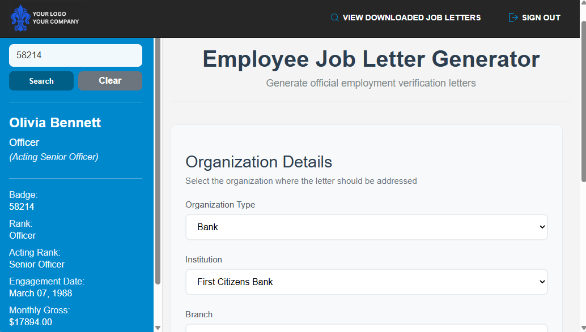

# Portfolio

A minimal, self-contained developer portfolio — plain HTML and CSS, no build step.

## Files

- `index.html` — page structure and content
- `styles.css` — all styling
- `assets/` — put your screenshots and images here (e.g. `assets/project-one/01_overview.png`)

## Editing your content

1. **Hero** — replace `Your Name`, the tagline, email, and social links near the top of `index.html`.
2. **Projects** — each project is one `<article class="entry">` block. Update:
   - title, status pill (`live` / `archived`), tagline
   - demo and source links
   - `problem`, `solution`, `stack` fields
   - screenshots (see below)
   - `features`, `challenges`, `lessons learned`
3. **More projects** — copy an existing `<article class="entry">...</article>` block, paste it below the last one, and update its `id`, `log[0N]` index, and content.
4. **About / Contact** — update the two closing sections and the footer links.

## Adding real screenshots

Each project currently has dashed placeholder boxes. To use a real screenshot, replace:

```html
<figure class="shot-placeholder">
  <span>01_overview.png</span>
</figure>
```

with:

```html
<figure>
  
</figure>
```

Keep images reasonably sized (compress large PNGs/JPGs) so the page stays fast.

## Publishing with GitHub Pages

1. Create a new GitHub repository (e.g. `your-username.github.io` for a root-level site, or any name for a project site).
2. Push these files to the repository root:
   ```bash
   git init
   git add .
   git commit -m "Initial portfolio"
   git branch -M main
   git remote add origin https://github.com/your-username/your-repo.git
   git push -u origin main
   ```
3. In the repo, go to **Settings → Pages**.
4. Under **Build and deployment**, set **Source** to `Deploy from a branch`, branch `main`, folder `/ (root)`.
5. Save. Your site will be live at `https://your-username.github.io/your-repo/` (or `https://your-username.github.io/` if you used the special repo name).

## Notes

- Fonts (IBM Plex Sans / Mono) load from Google Fonts via the `<link>` tags in `index.html` — no local font files needed.
- The layout is fully responsive and respects `prefers-reduced-motion`.
- No JavaScript framework or build tool required — just static files.
